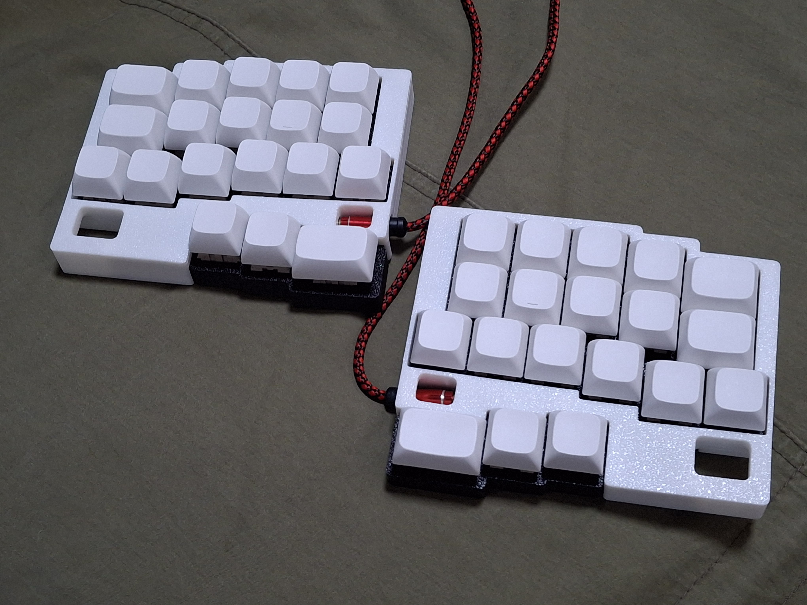

# modubu

semi-staggered(half row staggered, half column staggered) 38 key split keyboard under 100x100mm pcb

Started idea on my old sketch and [KeeNoard](https://github.com/yuburoll/KeeNoard), finished and polished the idea thanks to the great [DYA Dash](https://cormoran.github.io/dya-dash-keyboard/).

(Really surprisingly, I made this similar layout when I don't know about DYA Dash.)

credit for 우주신제품(wujusinjepum), the anonymous who named this keyboard.

## Preparation

- 2x rp2040 zero (boards formly created by waveshare) (Approx. 4-8$)

- 2x modubu PCB Boards (5 boards are 2$ on JLC w/o shipping cost)

- 1x printed case sets, which you want to make it (Approx. 12$ if you buy printed one on JLC)

- 38x diodes (Approx. 1$)

- 22x M2x6 screws, flathead (Approx. 1$)

- 2x PJ320A 1/8(3.5mm) TRRS connector (Approx. 1$)

- 1x 1/8(3.5mm) TRRS cable (Approx. 2$, may TRS cable can take the place.)

- 38x Hotswap SMD (Approx. 4$)

- 38x Keyswitches & Keycaps (Maybe this cost varies too much. 10$ on average)

Approx. 37-41$(w/o shipping cost) needed to build one.

## Build Guides

work in progress. sorry!

You can see the images in the folder, which uploaded for build guides. Especially you may see how to solder the controller board, because this uses surface mounting by castelated pins.

This uses [qmk](https://qmk.fm/) to build the firmware. Copy "modubu" folder which is in "firmware/qmk" directory to "qmk_firmware\keyboards" folder, and build it via qmk msys.

Or, simply flash uf2 in "uf2Examples" folder by changing rp2040 zero in dfu mode, which can be executed by holding boot button while plugging in usb c. Vial versions are also prepared.

## Notes

(from my reddit reply) 

I made this keyboard for very local and ethnic layouts - Especially Koreans.

Koreans have lots of vowels, so we use left hand for consonants and right hand for vowels. The tragedy starts from here: B position is vowel(ㅠ, yu) in Korean keyboard, so very lots of Korean typers press B in right hand, still they use B in left hand when they typing English words.

Many Korean split ergo keyboard users literally suffers with B position problem; and this is one of most stiff learning curve of them. Some exchanges semicolon to B key, some slides the bottom row or have double B (zxcvbnm,./ => /zxcvbnm,. or zxcvbbnm,.) and some just get used to it.

And after the B, Koreans type many word like CamelCaseVariables (eg. past sentence "있었습니다(it-sut-SOUP-nee-da)" types like "dlTdjTtmqslek") - which make home row mods very cumbersome. We may have seperated shift key for this.

So that's why I made row stagger split design with additional keys: But I was surprised that I'm not the first one with this idea and layout.

## Licenses

all codes follow MIT license.

all designs and the hardware board follow CC BY-SA 4.0 license.

If you want to make a commercial product, it would be appreciated if you sponsor some bucks for me.
