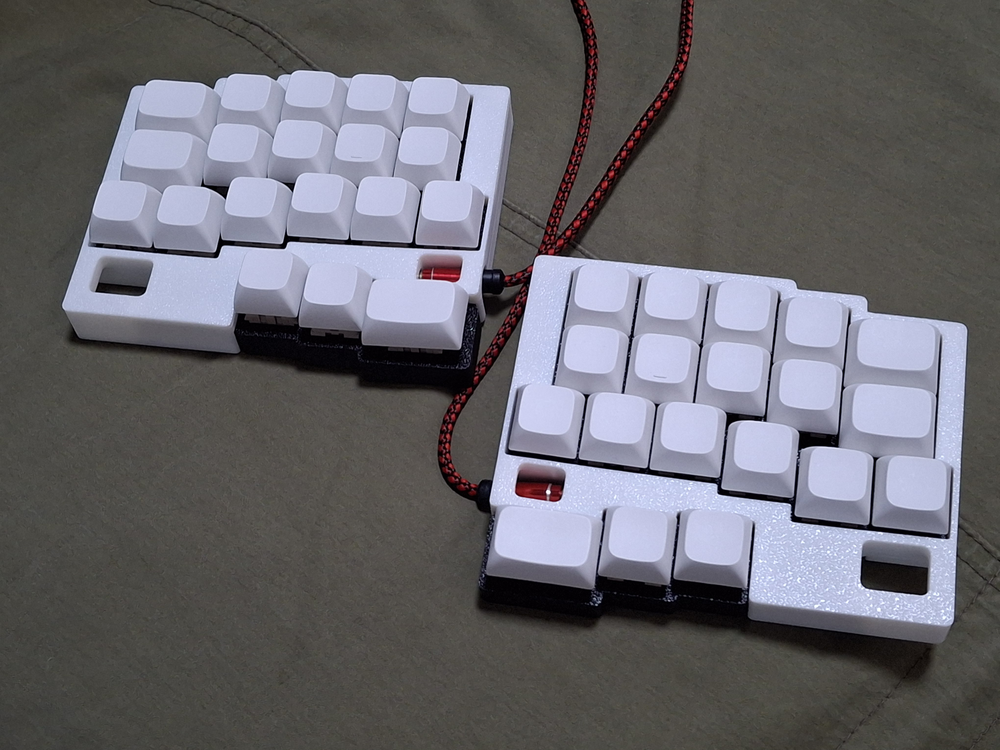
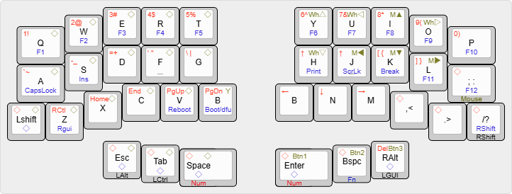
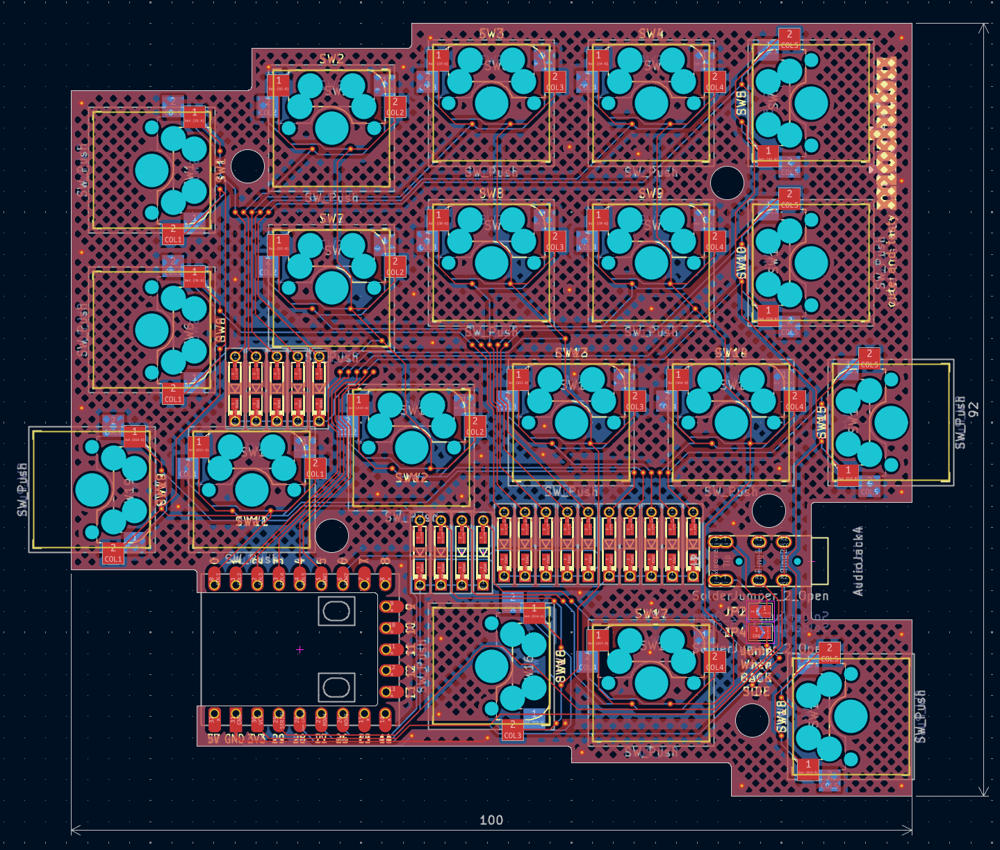

# modubu 모두부

100x100mm 이하 크기 PCB를 가진 38키 세미스태거 스플릿 키보드

아이디어는 예전에 스케치했던 초안과 [KeeNoard](https://github.com/yuburoll/KeeNoard)에서 시작했고, [DYA Dash](https://cormoran.github.io/dya-dash-keyboard/)덕분에 디자인을 끝마칠 수 있었습니다.

(DYA Dash와 유사한 건 의외로 우연입니다. 이거 처음 스케치하고 있을 땐 정말 이런 키보드가 있는지 몰랐어요. 덕분에 좀 더 좋은 디자인 레이아웃으로 수정할 수 있었습니다.)

키보드의 이름을 지어주신 우주신제품님께 감사를 드립니다.

## 준비물

- rp2040 zero 보드 2개 (waveshare에서 처음 디자인된 물건입니다.) 5천원~1만2천원

- 모두부 pcb 보드 2장 (JLCPCB에서 배송비 제외 2달러 = 3천원정도 합니다)

- 3d 프린팅된 케이스, 총 6파츠 (JLC에서 약 12달러(1만8천원)가량 합니다만 FDM 프린터 대행 등에서 싸게 뽑는 쪽을 추천드립니다)

- 다이오드 38개 (약 1천원-4천원)

- M2x6 접시머리 스크류 나사 22개 (약 1천원)

- PJ320A 3.5mm TRRS 커넥터 2개 (약 1천원)

- 3.5mm TRRS 케이블 1개 (약 3천원, TRS도 됩니다)

- MX 핫스왑 소켓 38개 (약 6천원-1만2천원)

- MX용 키스위치 38개와 키캡 세트

키캡과 키세트, 배송비 제외 3만8천~5만4천원에 한 세트를 갖출 수 있습니다.

## 기본 키맵

키를 길게 누르고 있으면 키맵의 최하단 글자로 작동합니다.

레이어는 Num/Mouse/Fn 3종이며, 각자 색이 배정되어 있습니다. ◇ 모양은 기본 레이어의 키맵과 동일하다는 의미입니다.

## 빌드 가이드

[**보러가기**](documents/buildGuide_ko.md)

## 라이센스

모든 코드는 MIT 라이센스를 따릅니다.

모든 디자인과 하드웨어 보드는 CC BY-SA 4.0 라이센스를 따릅니다.

상업용 제품을 만들고 싶으신 분은 몇 푼 정도만 후원 해주시면 감사하겠습니다...

