# 빌드 가이드

modubu의 빌드 가이드입니다.

### 추가 자료

[**준비물과 구매처 가이드**](preparation_ko.md)

[**납땜 팁**](solderingTip_ko.md)

## 다이오드 납땜하기

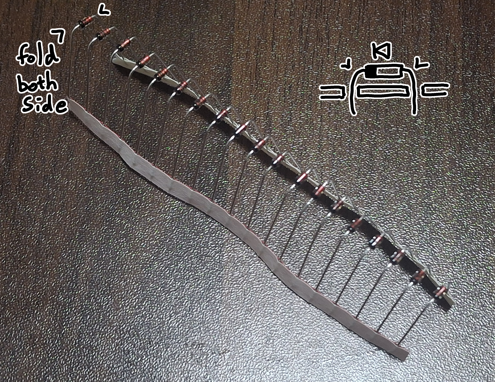

THT 다이오드를 사용한다면, 다이오드의 다리를 ㄷ자로 미리 굽혀서 준비합니다.

다음의 두 이미지를 참고하면서 다이오드를 붙입니다. 앞면인지 뒷면인지는 상관없으며, **모든 다이오드 방향이 아래를 향해야 합니다.**

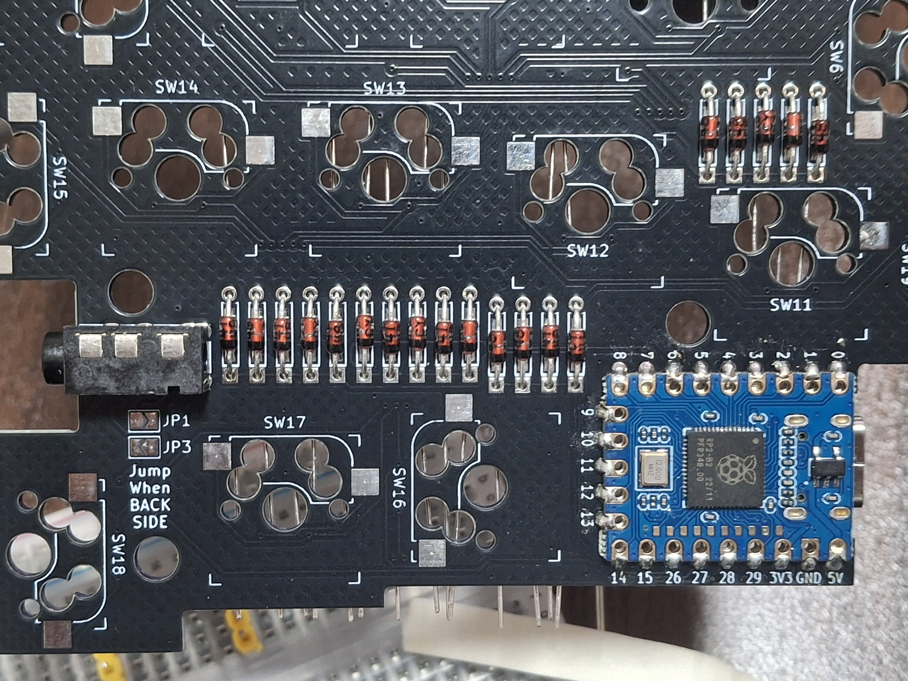

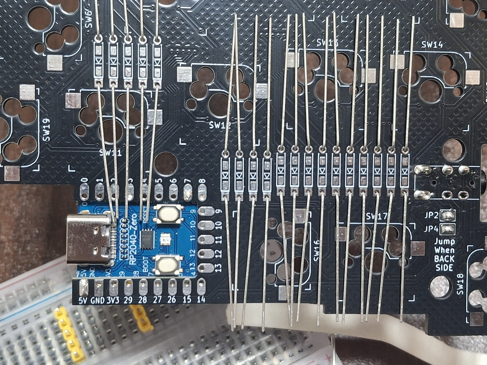

납땜을 마치면 다이오드의 뻗어난 잔가지 다리부분을 니퍼로 모두 자릅니다. 주변 패드에 닿지 않게 바짝 당겨서 잘라둡니다. 자를 땐 튕겨나가지 않도록 꼭 다리를 손가락으로 잡고 자릅시다.

SMD 다이오드를 사용할 땐 다이오드 위치의 한 쪽 패드에 납을 묻히고, 납을 묻힌 패드에 열을 가하면서 패드의 납이 녹았을 때 다이오드의 한 쪽 다리를 가져다 붙인 뒤, 반대쪽 다리를 땜합니다.

## 컨트롤러 보드 납땜하기

빵판이 있으면 편하기에 빵판을 쓰는 걸 기준으로 설명합니다.

빵판이 없다면, 다음의 과정을 참고하며 헤더 핀을 이용해 컨트롤러 보드를 pcb 위에 정렬한 뒤 땜해주세요.

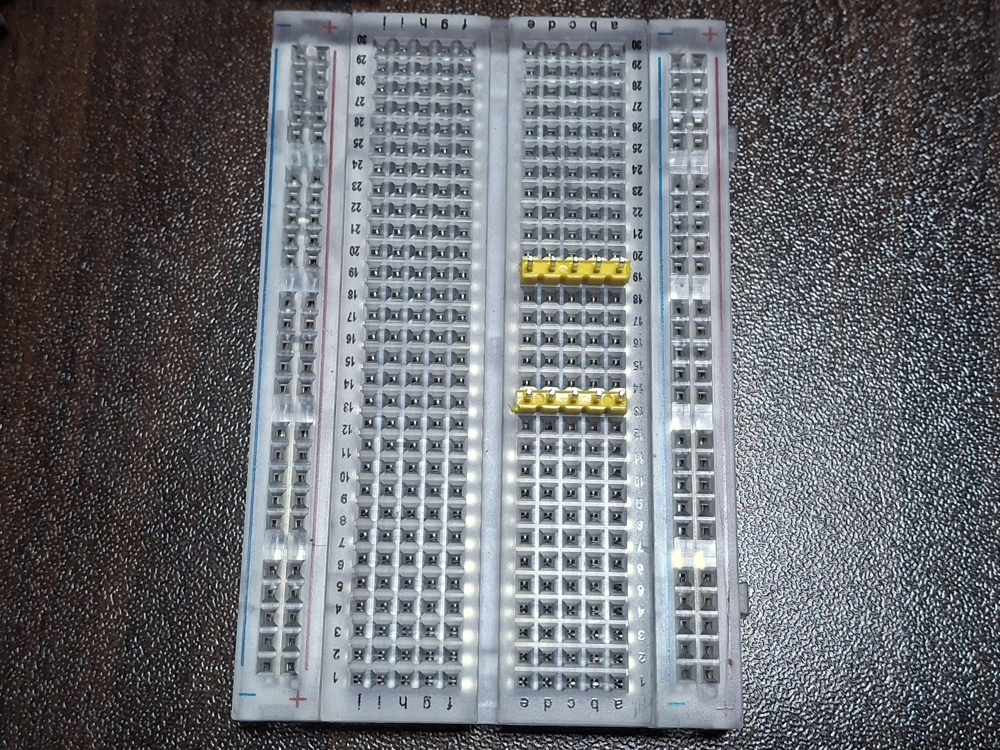

컨트롤러 보드의 양옆 간격만큼 벌려둔 상태로 빵판에 위치 정렬을 위한 핀을 꼽아둡니다. 동봉되어있을 헤더 핀들 중 짧은 쪽을 사용합니다.

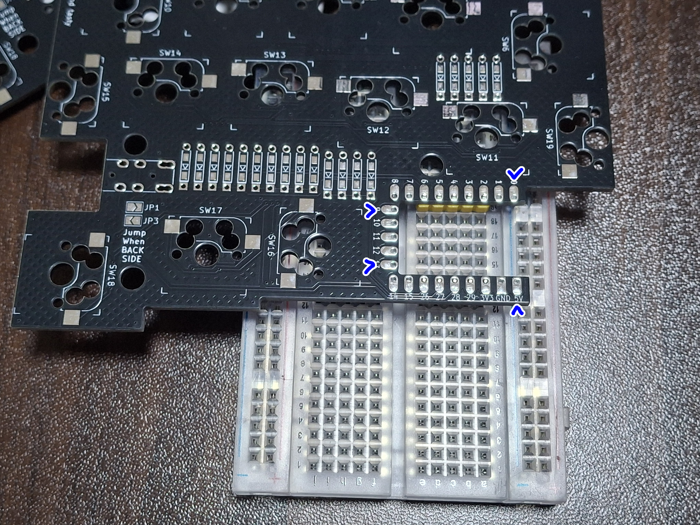

이 위에, 사진처럼 **보드의 오른쪽용 면을 위로 한 채로 pcb를 얹습니다.** **0번 핀, 5v 핀, 9번 핀, 13번 핀에 위치 정렬용 핀이 꼽히지 않도록 합니다.** 

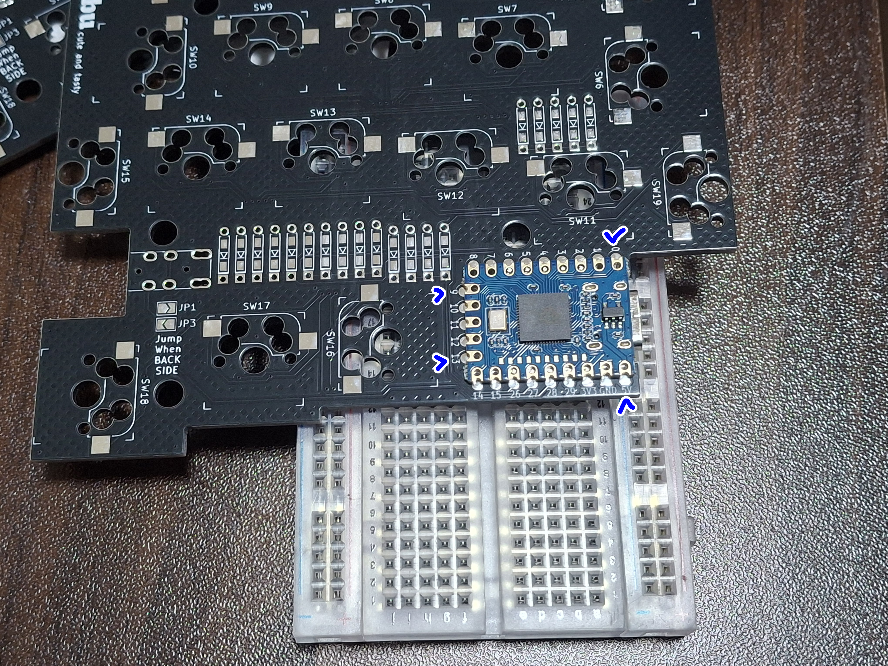

이 위에, 사진처럼 프로세서 면이 위로 가도록 컨트롤러 보드를 얹습니다. 위치 정렬을 확인하고, pcb 위에 적힌 글을 참고해 핀들이 제대로 위치되어있는지 확인합니다.

**0번 핀, 5v 핀, 9번 핀, 13번 핀을 먼저 땜하고 위치 정렬용 핀을 뗍니다.** 캐슬레이티드 핀, 즉 울퉁불퉁한 핀 테두리와 pcb의 패드를 납땜해 연결합니다.

이후 나머지 프로세서 핀 부분을 땜합니다.

**키보드 두 쪽 모두 똑같은 면에 똑같은 방향으로 프로세서 보드를 붙여야 합니다.**

## 컨트롤러 보드에 펌웨어 올리기

컨트롤러 보드의 Boot 버튼을 누르며 usb를 연결하면 이동식 디스크가 하나 뜹니다. (이를 dfu모드라고 합니다.)

[uf2examples 폴더](../firmware/qmk/uf2examples) 안에 있는 .uf2 파일을 해당 이동식 디스크에 집어넣으면 펌웨어가 들어갑니다. vial 펌웨어를 올리시는 걸 추천드립니다.

펌웨어에는 [qmk](https://qmk.fm/)를 사용하고 있습니다. 펌웨어를 직접 만들고 싶다면 "firmware/qmk" 경로 내의 "modubu" 폴더를 "qmk_firmware\keyboards" 경로로 붙여넣어 qmk msys를 이용해 빌드하면 됩니다.

완전히 조립된 이후 펌웨어를 올리려면 한 쪽은 버튼을 누를 수 없어 문제가 생깁니다. 그래서 **컨트롤러 보드를 납땜한 직후 펌웨어를 올리시는 걸 추천합니다**.

펌웨어를 올린 이후 dfu 모드에 들어갈 땐 썸클러스터(엄지 버튼들)의 가장 안쪽을 누른 채 키보드를 연결하면 됩니다.

## 핫스왑 소켓 납땜하기

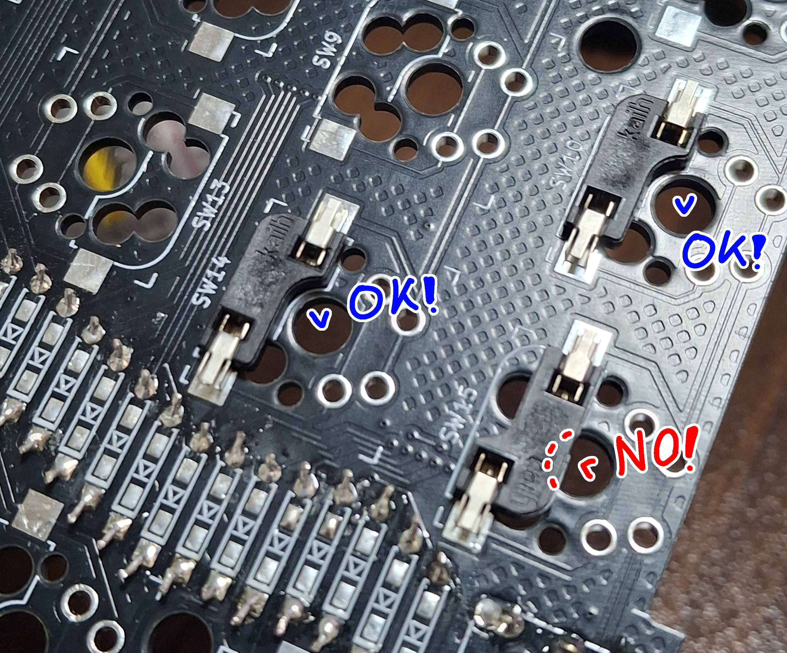

(이미지의 보드는 [Boardloaf](https://github.com/yuburoll/Boardloaf)입니다.)

이제 각 손의 뒷면에 핫스왑 소켓을 납땜합니다. 핫스왑 소켓을 납땜할 땐 위 이미지처럼 역방향으로 꽂힐 수 있으므로, **pcb 보드에 있는 표시를 참고하며 정방향으로 꽂아서 땜합니다.**

## 커넥터 납땜하기 & 점프하기

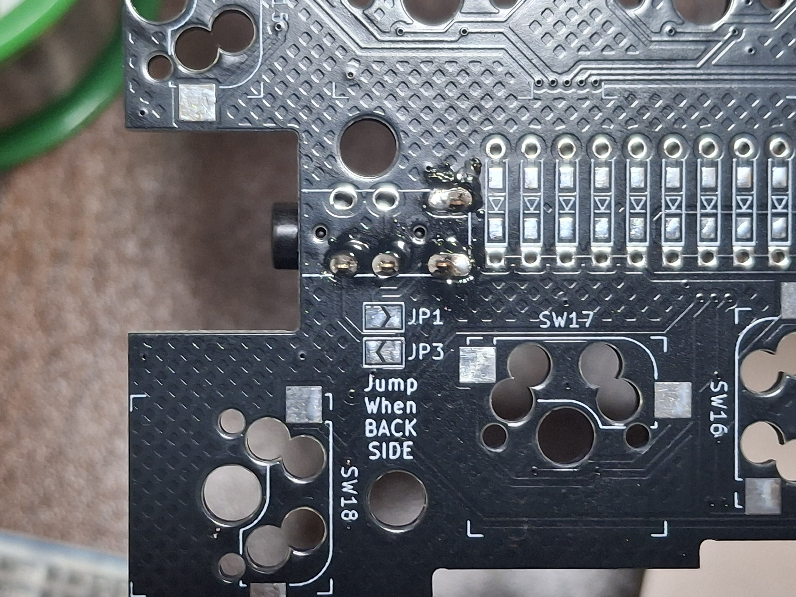

각 손의 윗면 부분에 커넥터가 오도록 TRRS 커넥터를 배치하고, 뒷면에서 납땜합니다. 납땜할 때 마스킹 테이프 등으로 고정해두면 좋습니다.

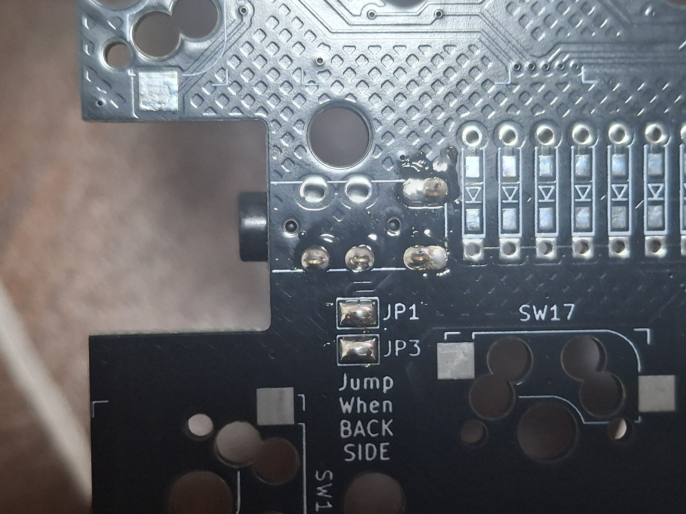

이 면을 보고 있는 상태에서, "JUMP when BACK SIDE"라는 문구 위의 점퍼 두 점을 땜납으로 점프합니다. 반대쪽 면(=커넥터가 올라가 있는 윗면)은 하지 않습니다.

땜납의 두 부분을 인두기로 최대한 동시에 대고, 땜납을 물방울처럼 솟아오를 만큼 공급하면 서로 붙으면서 이어지는 느낌이 납니다. 이때 떼 주면 서로 붙습니다.

잘 안 되면 점퍼 부분을 잠시 식혔다가, 충분한 양의 플럭스를 팁과 점퍼에 묻히고 다시 시도해보세요.

## 조립상태 확인하기

다음 두 이미지를 참고해서 조립이 제대로 됐는지 확인합니다. 다이오드가 올라가 있는 면은 방향만 맞다면 상관 없습니다.

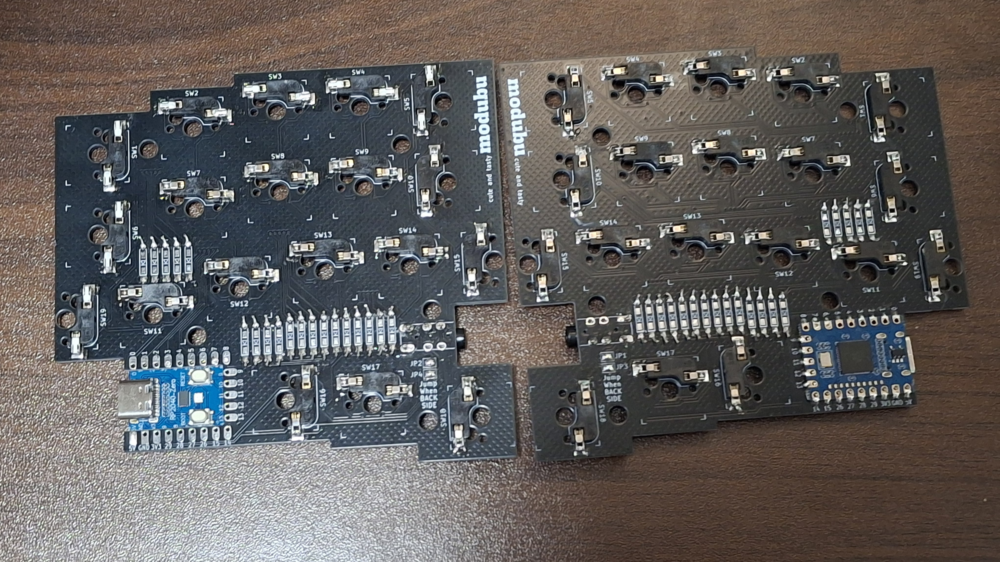

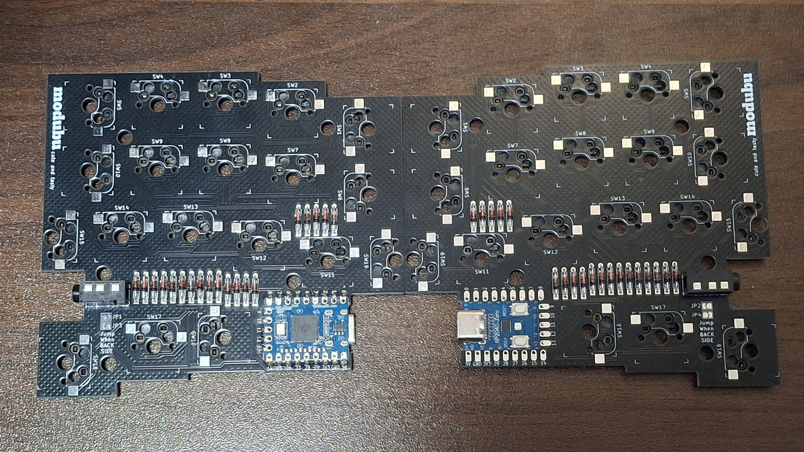

## 케이스와 스위치 조립하기

다음 두 이미지를 참고해서, Up와 Mid로 표기된 케이스 부품과 스위치를 미리 조립합니다.

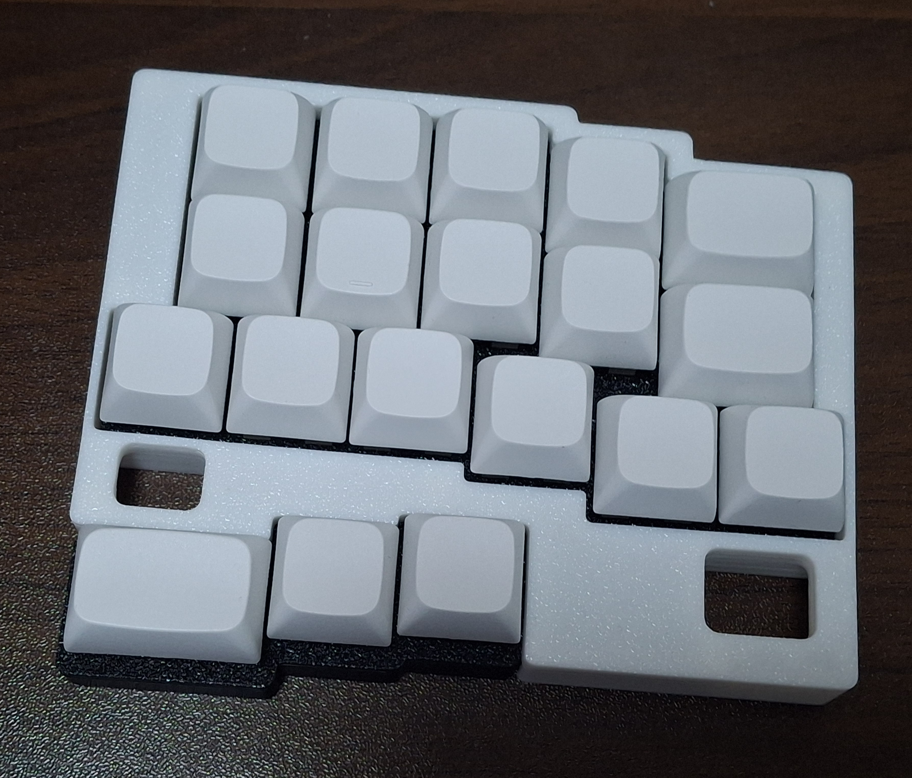

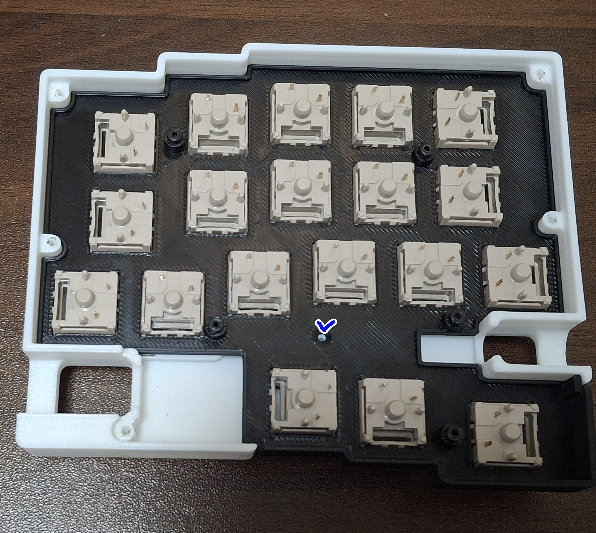

위 이미지의 v자 마크가 붙은 부분에 나사를 끼웁니다.(필수는 아닙니다) 이후 이 위에 다음 이미지처럼 조립한 보드를 얹습니다.

보드를 얹을 땐 먼저 바깥쪽의 스위치부터 눌러 핫스왑에 결합하고, 서서히 중앙부에 가까워지도록 스위치를 눌러 모든 스위치를 핫스왑과 결합하는 걸 추천합니다.

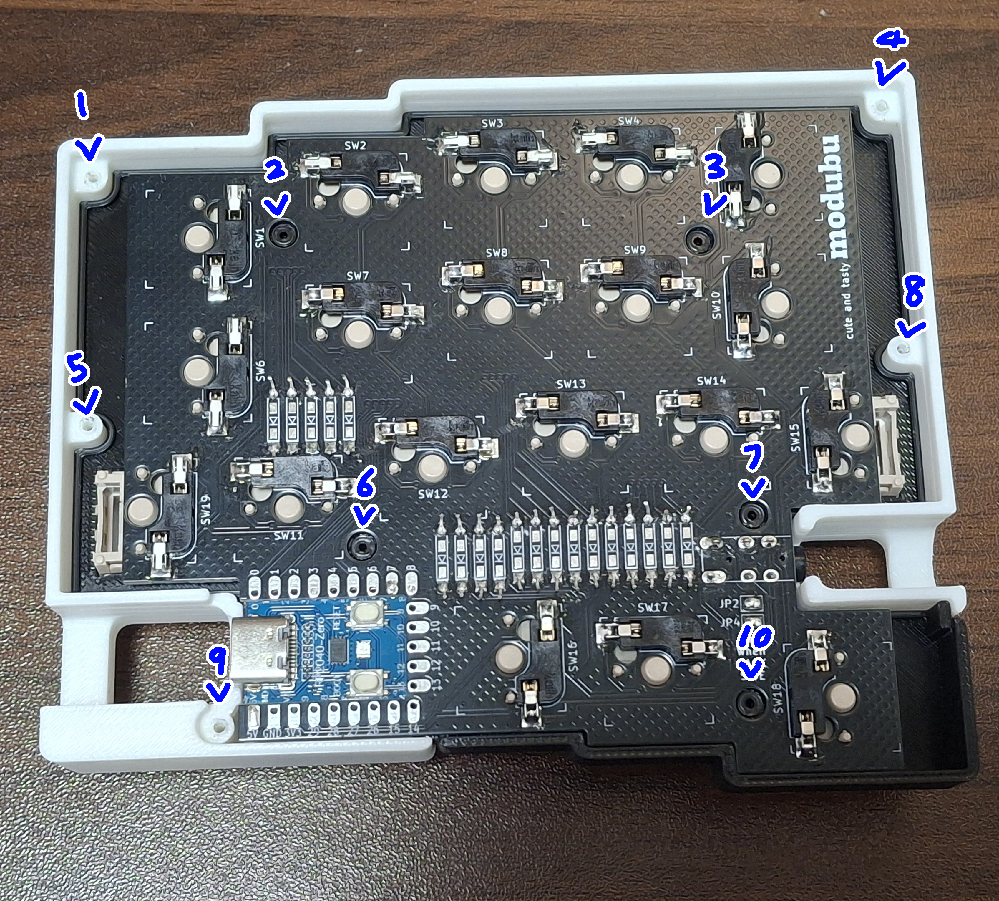

모든 스위치가 핫스왑에 제대로 결합됐음을 확인하면 Down으로 표기된 케이스의 바닥 부분을 올려 덮고, v자 마크가 붙은 부분에 나사를 끼워 조립합니다. 한 쪽마다 총 10곳 입니다.

마지막으로 키보드의 범폰 위치에 범폰 4조각을 붙이면 완성입니다.
